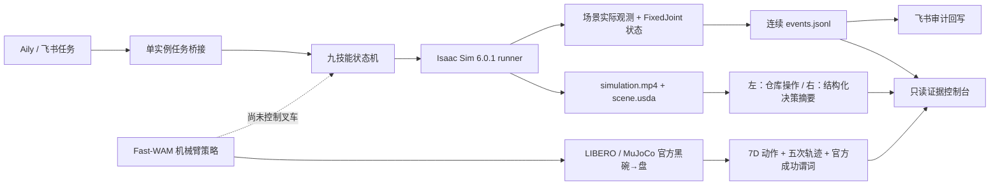

# SEER–HVLA Demo 项目总结与交付说明

> 更新时间：2026-08-16
>
> 当前结论：Demo 已按“局部重构”路线完成；新增显式 USD 物理挂接、双叉孔托盘、设施局部坐标偏航、静态碰撞合同、双层架构同步视频与对话式 AgentOS 控制台，可在本地（macOS/Linux/Windows Git Bash）展示、在 Isaac Sim 环境复现。
>
> 公开分支：[`captainNemoCheng/feature/bowl-ui-collision-v2`](https://github.com/captainNemoCheng/seer-competition/tree/feature/bowl-ui-collision-v2)
>
> 合并目标：`imChenRH/seer-competition:master`

> Fast-WAM 正式运行 `fastwam-bowl-plate-20260816-v2-r1` 使用官方 LIBERO `libero_goal` task 8 和 300 步预算；五个固定初态均通过原版成功谓词，实际执行 77–84 步。5/5 只描述随附固定初态，不是通用成功率或完整官方基准。

> 2026-08-16 V5/V6 正式重渲染说明：normal/recovery 使用 V5 侧前方动态跟随机位证据；intervention 使用 V6 分离障碍物证据。原始视频、分屏视频、USDA、JSONL 与 manifest 均来自 AutoDL RTX 4090 / Isaac Sim 6.0.1 正式运行并在 Mac 复验。防穿模结论只限定于随附运行，不外推为生产安全认证。

## 1. 项目目标

本项目面向与仙工智能的企业交流，目标是完成一个可以稳定运行和展示的叉车任务仿真 Demo：由 Aily/飞书生成任务，执行层按九项叉车技能完成卸货任务，在异常情况下执行 Fallback 或安全停车，并通过 Isaac Sim 画面、连续事件和网页控制台共同展示结果。

Demo 的核心价值不是“画面会动”，而是让任务、动作、异常恢复、终态和展示页面使用同一份可验证证据，避免脚本日志、飞书状态、网页数字和录像互相矛盾。

## 2. 最终方案结论

严格审计后的明确结论是：**局部重构，不推倒重来**。

保留的部分：

- 叉车卸货业务场景、九技能序列和 Fallback 设计。
- Aily/飞书多维表格和任务编排思路。
- AutoDL RTX 4090、Isaac Sim 6.0.1 和已有远端资产。
- Fast-WAM 模型加载与七维动作输出的独立验证结果。
- 与仙工智能合作、后续接入实机接口的目标。

重构的部分：

- 用单一 JSONL 事件契约替代分散且互相矛盾的状态口径。
- 用共享状态机重新实现 normal、recovery、intervention 三场景。
- 重做飞书桥接，保证一个任务只启动一次 runner。
- 重做 Isaac 场景、动作观测、录像和 OpenUSD 证据。
- 用只读证据控制台替代硬编码成功率和定时动画页面。
- 增加自动化测试、清单哈希、声明边界和严格复审。

## 3. 系统架构



任务真相以 `events.jsonl` 为准。飞书终态、网页技能进度、Fallback 数量和运行时长都由验证后的事件派生，不能单独制造成功结论。

## 4. 已完成工作

### 4.1 任务和技能状态机

- 固定九技能序列：进箱导航、精确对位、栈板识别、货叉插入、门架起升、货叉倾斜、月台区导航、传送带对接、栈板放置。
- normal、recovery、intervention 使用同一个执行引擎。
- 技能只有在观测状态满足谓词后才能写入 `skill_completed`。
- 事件序号必须从 0 连续增长，仿真时间必须单调，最后必须且只能有一个终态事件。
- Isaac 决策事件必须包含 `stage_observed=true` 和非负、单调的 `observed_frame`。
- 终态事件必须与前一个实际决策事件拥有完全一致的状态和观测帧。
- 导航后置条件使用 Isaac 实测平面位姿与“当前场景、当前阶段目标”的误差（容差 1 cm）；人工介入的避障目标不再错误套用 normal 的绝对坐标阈值，同一技能 ID 的后续内部路径也不能覆盖首次业务观测。

### 4.2 异常恢复与安全停止

- `FB-F01`：栈板横向偏移超限后重新识别和对位。
- `FB-F02`：遮挡条件下切换两个不同观察位姿。
- `FB-F07`：连续三次识别失败后退到箱外安全等待点。
- 安全停车必须同时满足 `stopped=true` 和有限速度 `|base_speed_mps| ≤ 0.01`。
- intervention 不冒充成功，正确终态为 `HUMAN_REQUIRED`。

### 4.3 Isaac Sim 场景与录像

- 使用 Isaac Sim 6.0.1，在 AutoDL RTX 4090 环境离屏渲染。
- 场景采用 Z-up 坐标和局部子部件变换，扩展为 44×28 m 仓库，包含 10 组货架、7.5×3.4×3.5 m 剖视集装箱、四轮叉车、双叉孔栈板和滚筒传送带。
- 四个车轮改为沿横向轴放置的圆柱体，轮心高度等于半径；叉车根节点全程保持 `z=0`。集装箱地板下沉到顶面 `z=0`，与仓库地面齐平，轮胎进箱时不会嵌入地板。集装箱和传送带的朝向统一为 `0°`，与地面黄线平行；路径、载荷挂接和放置误差仍按设施局部坐标计算。
- 地面、仓库外壳、货架、集装箱、月台、传送带和背景载荷执行常驻静态碰撞合同；故障障碍物仅在 intervention 可见并激活碰撞，normal/recovery 不留下隐形碰撞体。V5 normal/recovery 各验证 193 个静态碰撞 Prim，V6 intervention 为 195 个。叉车和活动托盘属于运动对象，灯光、相机、标线和材质引用不属于碰撞对象。
- 引用 NVIDIA SimReady Warehouse-01 的 concrete、metal、cardboard、rubber 四种物理材质，并保留本地程序化场景作为可复现降级。
- 正式 USDA 写入 `PhysicsScene`、碰撞、刚体、质量与 `PhysicsFixedJoint`；不再把运动学叉车根错误声明为 ArticulationRoot。FixedJoint 的局部锚点在每帧与车体/载荷变换对齐，载荷释放后从 PhysX 世界变换读取朝向。
- 基座、门架、货叉倾斜和载荷均写入 OpenUSD `xformOp` 时间采样。
- 载荷抓取必须同时满足相对几何对齐和 `FixedJoint` 已启用；放置后关节关闭，不由网页或日志常量伪造。
- 控制仍为确定性运动目标，不是标定力控；正式摘要逐条保留该降级原因。
- normal 和 recovery 的货叉倾角实际达到 4°。
- intervention 车辆退至箱外 `x=-1.0`，无载荷并停稳。
- 新增纯 Python 2.5D OBB/SAT 守卫：每相邻帧同时按车身/载荷平移、载荷偏航、门架升降和货叉倾角取共同最大采样数；平移/升降步长不大于 0.025 m，偏航/倾角步长不大于 0.5°。守卫检查车身、随 4° 倾角变化的叉架/双货叉，以及自由、搬运和已放置载荷；时间线生成和 Isaac 每帧写入前均失败关闭。
- 传送带由左右侧梁、3 根横撑、4 条支腿和 11 根横向圆柱滚筒组成；滚筒顶面为 `z=0.78 m`，载荷释放后由滚筒支撑并等待低速稳定。
- 新路线先绕行、在禁入包络外对正 `0°`，再沿传送带局部 X 轴直进；intervention 在可见障碍物前缩短进场点。
- `2.5D_OBB_SAT_SWEEP_V4` 守卫静态几何与场景共用同一组尺寸/位姿定义，覆盖仓库墙梁、集装箱地板/侧墙/顶梁、月台、货架、传送带、背景载荷和 intervention 障碍物；动态集合显式包含车身、四轮、倾斜叉架、双货叉，以及与场景共用的 5 根 deck、3 根 runner 和 4 个 cargo。只有方向正确、误差不超过 1 mm 的支撑面接触可放行；车轮或载荷向下穿入地板以及其余动态—动态/动态—静态重叠均失败。
- 两块 intervention 障碍物由场景与守卫共享同一组几何定义，底面都落在 `z=0`、X 方向保持 0.05 m 间隙，并避开活动托盘。V5 normal/recovery 与 V6 intervention 分别完成 1128953、1248809、651784 次 Z 区间相交后、白名单过滤后的 SAT 候选对检查，障碍物相互穿透、禁碰数和接触违规数均为 0；normal/recovery 最小车身净距 0.213986 m，intervention 为 0.387376 m，水平放置误差为 0（允许上限 0.02 m）。
- 相机采用 13 mm 侧前方动态跟随和逐帧主体包络拟合；近距识别、插叉、抬升、搬运和放置阶段把货物与完整叉车同时纳入构图。平滑后解析边距仍不低于 5%；机位限制在中央走廊、集装箱后墙前方和顶梁下方，避免货架载荷与横梁遮挡。

### 4.4 Aily/飞书桥接

- 桥接在同一主机和同一证据目录内使用排他锁，避免两个进程同时执行。
- 新任务写入全新的 `task_id` 目录，一个任务只启动一次 Isaac runner。
- runner 成功后，一次写入四个产物的本地 SHA-256 恢复收据。
- 恢复时只允许验证收据并回放未写入的审计事件，不会静默重启 runner。
- `最后事件序号` checkpoint 严格接受非布尔整数；缺失为 `-1`，数值 `0` 不会被误判。
- checkpoint 越界直接失败；若审计已到终态但飞书状态仍陈旧，会恢复终态且不重复写审计。
- 现场任务 `T-DEMO-20260813-001` 已验证只启动一次 runner，审计序号连续 0–19。`FEISHU_LIVE_RECEIPT.json` 是该任务的脱敏操作员见证，不是上方三份 2026-08-15 正式录像的现场见证，也不能当作平台签名证明。

### 4.5 证据控制台

- 页面只读取已通过严格校验的正式运行目录。
- 以“正常执行 / 自动恢复 / 安全介入 / Fast-WAM 碗→盘”四个页签组织证据。
- 参考随附飞书 AgentOS 截图重构首屏：默认只显示四个模式、AgentOS 身份、角色说明、快捷指令和输入框；用户发送后才展开任务分发、视频与边界说明。
- AgentOS 输入区展示任务指令、大脑层结构化意图、小脑层技能/Fallback 分发与审计游标；输入若与证据不一致则恢复到可审计任务，不冒充新执行。
- 正式 `presentation.mp4` 左半屏展示 Isaac 仓库内部操作，右半屏按 `observed_frame / fps` 的视频帧时钟投影结构化决策摘要（无观测帧的启动事件继承前一观测边界）；不展示隐藏思维过程。事件 JSONL 中的 `sim_time_s` 是任务逻辑时钟，分屏层不再把它直接当作视频秒数。
- 分屏构建显式使用 CJK 字体；无可用中文字体时失败关闭，不再退回到不含中文字形的字体生成方框字。
- 运行、恢复、完成、人工接管分别使用蓝、琥珀、绿、红主题；主决策文字加大到 48 px，右侧背景和边框同时切换，状态变化无需依赖细小文字辨认。
- 同屏展示终态、九技能执行链、Fallback、安全事件和连续审计日志。
- 网页将视频/技能链宽度调整为约 74:26，发送任务后自动滚动到视频区；左侧“飞/聊/任/审”快捷栏已移除。
- 不展示无法从事件推出的固定成功率或虚构延迟。
- 页面明确标注当前是确定性运动目标与显式物理挂接的 Demo，不是仙工实机或生产安全证明。

### 4.6 Fast-WAM

- 使用 `lerobot/fastwam_libero_uncond_2cam224` revision `53983e1`，运行前验证 Hugging Face 下载元数据与 config/weights SHA-256，在 RTX 4090 / CUDA 上实际生成 7D 末端与夹爪动作；没有规则控制器补动作。
- AgentOS 任务为“把黑色碗放入盘子”，策略 prompt 为 `Put the bowl on the plate`；环境直接使用官方 `libero_goal` task 8 `put_the_bowl_on_the_plate`，不覆盖 BDDL、资产或成功谓词。
- 场景使用两个 224×224 相机观测、20 Hz 控制；策略每 10 个动作重新调用一次。五个固定 seed 每次最多 300 步，结果为 5/5，实际执行 84/79/77/79/80 步。
- 展示轨迹包含 85 帧、84 个动作和 9 次策略调用；`presentation.mp4` 为 2560×1080、20 fps、85 帧，左右栏使用同一帧时钟。
- 每次尝试各自的视频、动作和物理状态均由 Manifest 哈希并逐次交叉验证；页面同时列出五次结果，但不把固定初态 5/5 写成泛化成功率或完整官方基准成绩。
- Fast-WAM 页面与三个叉车模式复用同一证据区、技能链、Fallback、审计和阶段时间轴；分屏右侧复用公共 TASK/BRAIN/CEREBELLUM/SAFETY/AUDIT 卡片。
- 第一次单次调用约 0.86 秒只作为早期独立技术验证保留；正式轨迹记录每次策略调用的实测延迟。
- 论文中的 190 ms 只能作为论文指标，不能写成本机实测。
- checkpoint 没有控制叉车；叉车接入仍需要企业数据、动作映射和安全门控。

## 5. 三个正式场景

| 场景 | 行为 | 事件数 | 技能完成 | Fallback | 终态 | 视频 |
|---|---|---:|---:|---:|---|---|
| normal | 完整卸货与传送带放置 | 20 | 9/9 | 0 | `COMPLETED` | 531 帧，66.375 秒 |
| recovery | 首次偏移失败，执行 `FB-F01` 后完成 | 24 | 9/9 | 1 | `COMPLETED` | 619 帧，77.375 秒 |
| intervention | 三次遮挡失败，调整视角、退回并停车 | 18 | 2/9 | 2 类 | `HUMAN_REQUIRED` | 289 帧，36.125 秒 |

三段原始仿真视频均为 H.264、1280×720、8 fps；三段同步展示视频为 H.264、2560×1080、8 fps，二者逐帧时钟一致。Isaac 后端的事件时长从时间线帧时钟派生，保证未来正式重渲染的事件 `sim_time_s` 与视频帧一致；历史证据由分屏层按 `observed_frame` 对齐。每个正式运行目录包含：

```text
events.jsonl     连续事件和观测状态，唯一事实源
summary.json     从已验证事件派生的摘要
scene.usda       带时间采样的 OpenUSD 场景
simulation.mp4   对应本次运行的 Isaac 录像
presentation.mp4 2560×1080 双层架构同步展示视频
```

顶层 `demo/evidence/MANIFEST.json` 记录运行环境、视频探测结果、文件大小和 SHA-256，同时纳入飞书操作员见证回执与 Fast-WAM 脱敏验证材料。飞书回执是操作员见证，不是平台签名证明。

## 6. 验证和复审结果

- 跨平台证据稳定性：新增 `.gitattributes` 将 Python/Markdown/JSON/JSONL/USDA/前端源码统一为 LF，避免 Windows 检出改写证据文件导致 Manifest SHA-256 复验不一致。

- Python 自动化测试：198/198 通过（Windows Git Bash 上依赖 macOS JavaScriptCore 的协议执行测试按预期跳过）。
- JavaScript 协议断言：48/48 通过。
- 三场景 Mac 干运行及三份正式 Isaac JSONL 全部通过严格语义校验。
- 三段原始视频与三段分屏视频的编码、分辨率、帧率、帧数和时长经 `ffprobe` 复验。
- 三份 USDA 均包含基座、门架、货叉倾斜、载荷与 FixedJoint 的时间采样。
- manifest 重算与仓库内容完全一致。
- 真实浏览器中四个页签、三段同步展示视频、任务分发和输入防伪均完成点击验收，三场景摘要与事件一致。
- 防穿模代码独立复审结论为 Critical 0、Important 0、Minor 0；本轮另完成三场景关键帧、叉取/举升/转弯/放置/安全撤退和中文分屏视觉复核。
- Git 提交前执行凭证精确值和高危令牌格式扫描，均为 0 命中。

## 7. 本地运行和展示

本地展示不需要安装 Isaac Sim，也不需要 GPU；`check`/`serve` 可在 macOS、Linux 或 Windows Git Bash 执行，展示使用仓库中已经复验的正式录像和事件。

```bash
cd <repository>
./scripts/run_demo.sh check
./scripts/run_demo.sh serve demo/evidence 8765
```

浏览器打开 `http://127.0.0.1:8765`，首屏仅显示四个模式和 AgentOS 对话；选择模式并在输入框发送已验证任务后，页面才展开任务分发和双层架构视频。

如需生成纯状态机干运行证据：

```bash
./scripts/run_demo.sh generate demo/evidence/local
./scripts/run_demo.sh serve demo/evidence/local 8765
```

## 8. 建议的企业展示流程

1. 用 30 秒说明边界：这是确定性运动目标与显式物理挂接的 Isaac Demo，不是实机闭环。
2. 展示首屏：说明 AgentOS 是任务与技能调度大脑；在 normal 页发送预填任务后再展开证据。
3. 展示 normal：完整九技能、无 Fallback、载荷被平稳放到与黄线平行的滚筒传送带。
4. 展示 recovery：指出首次识别失败、`FB-F01` 和第二次成功来自同一事件链。
5. 展示 intervention：指出三次失败、两个观察位姿、箱外退回、速度验证和 `HUMAN_REQUIRED`。
6. 展示飞书现场任务：一个任务只启动一次 runner，审计连续并可断点恢复。
7. 单独展示 Fast-WAM `[1, 7]` 输出，明确它尚未接管叉车。
8. 向仙工确认实机模型、动作接口、状态频率、坐标系、急停、安全 PLC 和日志格式。

## 9. 当前能力边界

本轮可以证明：

- 九技能任务编排和严格审计。
- normal 完成、recovery 自动恢复、intervention 安全停车和人工介入。
- Isaac Sim 确定性运动目标驱动的数字孪生执行与场景观测。
- 显式 USD 物理挂接、双叉孔几何以及几何/关节双条件的载荷状态判定。
- 任务指令、技能分发、仿真行为和审计事件的同步展示。
- 飞书到 Isaac runner 的演示级单实例桥接和幂等恢复。
- Fast-WAM 模型能够独立加载并输出七维动作。

本轮不能证明：

- 仙工 SRC-5000 或其他真实叉车已经接入。
- ROS 2、真实 RGB-D/雷达感知或安全 PLC 闭环已经完成。
- Fast-WAM 已控制叉车或完成叉车数据后训练。
- 动力学、轮胎、载荷和制动已经标定。
- 当前结果可以直接用于生产安全认证。

## 10. 下一阶段计划

### 企业接口对接

- 获取真实叉车 USD、URDF 或 CAD，以及质量、尺寸、关节限位和负载参数。
- 确认底盘、门架、货叉、急停、安全 PLC、状态与告警的 API/SDK/ROS 2 接口。
- 明确坐标系、控制频率、状态频率、超时、错误码和日志格式。

### 仿真升级

- 用企业模型替换当前演示级叉车几何体。
- 增加真实关节、接触、轮胎、载荷和传感器模型。
- 把确定性异常注入升级为传感器输入和可重复的场景随机化。

### Fast-WAM 接入

- 获得脱敏的叉车图像、状态、操作和失败数据。
- 先以影子模式输出建议动作，与规控结果对比，不直接下发执行。
- 完成后训练、动作映射、置信度门槛、规控兜底和急停门控后，再评估受控闭环。

### 证据升级

- 将本地哈希收据升级为外部签名或受保护的可信锚点。
- 增加多次重复运行、成功率分布和性能统计，避免用单次运行泛化系统能力。
- 在实机阶段保留相同事件契约，使仿真与实机证据可以直接对照。

### 必须由企业或人工提供

- 真实叉车 USD/URDF/CAD、质量、关节限位与负载参数。
- 底盘、门架、货叉、状态、告警、急停和安全 PLC 接口规范。
- 轮胎、摩擦、制动、载荷与地面材料的标定数据。
- Fast-WAM 叉车后训练所需的脱敏图像、状态、操作和失败数据。
- 可用的 GPU/网络部署环境以及现场签名或可信时间戳证据。

逐项原因和交付物见 [`NEEDS-HUMAN.md`](NEEDS-HUMAN.md)。

## 11. 主要文件索引

| 路径 | 用途 |
|---|---|
| `demo/README.md` | 运行、桥接和展示入口 |
| `demo/AUDIT.md` | 对旧成果的严格审计与重构依据 |
| `demo/CLAIMS.md` | 声明—证据矩阵和禁止表述 |
| `demo/NEEDS-HUMAN.md` | 进入实机和生产验证前必须补齐的企业输入 |
| `demo/seer_demo/contracts.py` | JSONL 事件契约与严格验证 |
| `demo/seer_demo/engine.py` | 九技能、Fallback 和终态状态机 |
| `demo/seer_demo/bridge.py` | 单次执行、收据恢复和审计回放 |
| `demo/seer_demo/feishu.py` | 飞书多维表格 API 边界 |
| `demo/seer_demo/isaac/` | Isaac 时间线、场景、观测与正式 runner |
| `demo/web/` | 只读证据控制台 |
| `demo/evidence/` | 三场景正式证据和顶层 manifest |
| `tests/` | 198 项 Python 测试和 48 项前端协议断言 |
| `scripts/run_demo.sh` | 本地检查、干运行和展示（macOS/Linux/Windows Git Bash） |
| `scripts/run_isaac_demo.sh` | Isaac Sim 正式运行入口 |
| `进度记录.md` | 历史过程及严格复核后的最新进度 |
| `待办事项.md` | 已完成门槛与下一阶段企业输入 |

## 12. Git 交付状态

- 公开分支：`captainNemoCheng/feature/bowl-ui-collision-v2`
- 合并目标：`imChenRH/seer-competition:master`
- 本地凭证：`demo/.env` 和《凭证汇总.md》，权限为 0600，均被 Git 忽略。

后续修改应继续提交到同一功能分支，由 PR 审查后再决定是否合并到原仓库。
